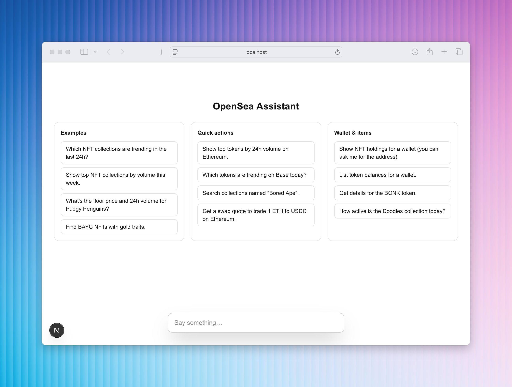

## OpenSea MCP + AI SDK (Next.js) Sample



This is a minimal Next.js app showing how to connect the OpenSea MCP server to the Vercel AI SDK to build an AI experience that can search, analyze, and act on OpenSea marketplace data.

- **AI runtime**: Vercel AI SDK (`ai`, `@ai-sdk/react`, `@ai-sdk/openai`)
- **MCP transport**: SSE to `https://mcp.opensea.io/sse`
- **Server route**: `src/app/api/chat/route.ts`
- **UI**: `src/app/page.tsx` with `useChat` and tool-call inspector

Full MCP docs: https://docs.opensea.io/docs/mcp

### What is OpenSea MCP?

OpenSea MCP is a hosted server that exposes tools for AI agents to access NFT collections, items, token data, wallet balances, swap quotes, trending analytics, and more across major chains.

---

## Quick Start

### 1) Prerequisites

- Node 18+ and pnpm (or npm/yarn)
- OpenSea MCP Access Token
  - More information: https://docs.opensea.io/docs/mcp

### 2) Install

```bash
pnpm install
# or
npm install
```

### 3) Configure environment

Create a `.env.local` file in the project root:

```bash
OPENAI_API_KEY=your_api_key_here
OPENSEA_BEARER_TOKEN=your_access_token_here
```

Environment variables:

- `OPENAI_API_KEY` — required by `@ai-sdk/openai` to run the selected OpenAI model (`gpt-5-mini` in this sample).
- `OPENSEA_BEARER_TOKEN` — required to authenticate requests to the OpenSea MCP server.

You can also use the provided `.env.sample` as a starting point.

### 4) Run the dev server

```bash
pnpm dev
# or npm run dev
```

Open http://localhost:3000 and try one of the example prompts on the home page.

---

## How It Works

This sample uses the AI SDK’s tool calling to dynamically fetch the tool list from the OpenSea MCP server and let the model call those tools as needed.

- The API route (`src/app/api/chat/route.ts`) creates an MCP client over SSE and forwards the tool list to the model:

```ts
// snippet from src/app/api/chat/route.ts
const openSeaMCPClient = await createMCPClient({
  transport: {
    type: 'sse',
    url: 'https://mcp.opensea.io/sse',
    headers: {
      Authorization: `Bearer ${process.env.OPENSEA_BEARER_TOKEN}`,
    },
  },
});

const tools = await openSeaMCPClient.tools();

const result = streamText({
  model: openai('gpt-5-mini'),
  system: 'You are a helpful assistant specialized in NFTs and tokens.',
  messages: convertToModelMessages(messages),
  tools,
  toolChoice: 'auto',
});
```

- The client (`src/app/page.tsx`) uses `useChat` to send/receive messages and displays structured tool-call I/O for transparency.

---

## Example Prompts

- Which NFT collections are trending in the last 24h?
- Show top NFT collections by volume this week.
- What's the floor price and 24h volume for Pudgy Penguins?
- Search collections named "Bored Ape".
- Show top tokens by 24h volume on Ethereum.
- Get a swap quote to trade 1 ETH to USDC on Ethereum.
- Show NFT holdings for a wallet.

---

## Deploying

Set the env var in your hosting platform:

- `OPENAI_API_KEY` (Required)
- `OPENSEA_BEARER_TOKEN` (Required)

Then build and start as usual:

```bash
pnpm build && pnpm start
```

Vercel users: add `OPENAI_API_KEY` and `OPENSEA_BEARER_TOKEN` in Project Settings → Environment Variables.

---

## Security & Notes

- Keep your MCP access token secret. Only expose it server-side.
- Rate limits apply per token. Use pagination for larger result sets where available.
- Chains can be specified in queries and tool inputs (e.g., Ethereum, Base, Polygon, Solana).
- OpenSea MCP will work with any model that supports tool calling. We recommend Claude Sonnet 4 or GPT-5.

---

## Learn More

- OpenSea MCP docs: https://docs.opensea.io/docs/mcp
- Vercel AI SDK docs: https://sdk.vercel.ai
- Next.js docs: https://nextjs.org/docs
